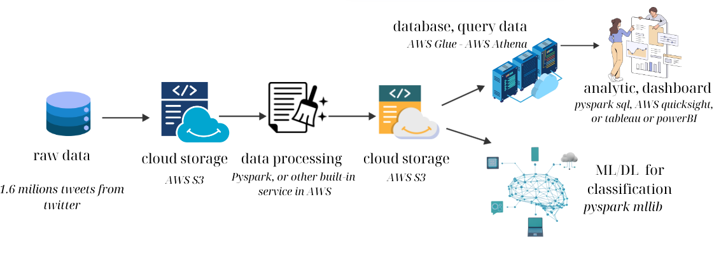

# Sentiment-Analysis-Big-Data-Project

# Công việc cần thực hiện

- **Tạo tài khoản AWS**:
  - Tạo IAM role và cấp quyền sử dụng S3.
  - Tạo access key để chia sẻ cho mọi người.

- **Tạo file `.py` đẩy dữ liệu lên AWS S3** (có vai trò như HDFS):
  - **Phụ trách**: Vinh.

- **Xử lý dữ liệu trong Notebook**:
  - Sử dụng access key từ IAM role, truy cập dữ liệu từ AWS S3.
  - Thực hiện:
    - Loại bỏ stop words.
    - Mapping lại label.
    - Lấy mẫu để tạo tập train và test.
  - **Output**:
    - 1 file dữ liệu đã xử lý.
    - 1 file train.
    - 1 file test.
  - Đẩy các file này trở lại AWS S3.

- **Phân tích và trực quan hóa dữ liệu**:
  - Tạo file Notebook sử dụng access key từ IAM role để:
    - Truy cập dữ liệu từ AWS S3, file dữ liệu đã làm sạch.
    - Thực hiện phân tích và trực quan hóa dữ liệu.

- **Huấn luyện mô hình phân tích cảm xúc**:
  - Tạo file Notebook sử dụng access key từ IAM role.
  - Lấy dữ liệu train và test để huấn luyện mô hình phân tích cảm xúc.
  - Sử dụng các mô hình Embedding mạnh mẽ như Bert + SparkNLP nhằm tăng cường độ chính xác cho mô hình
